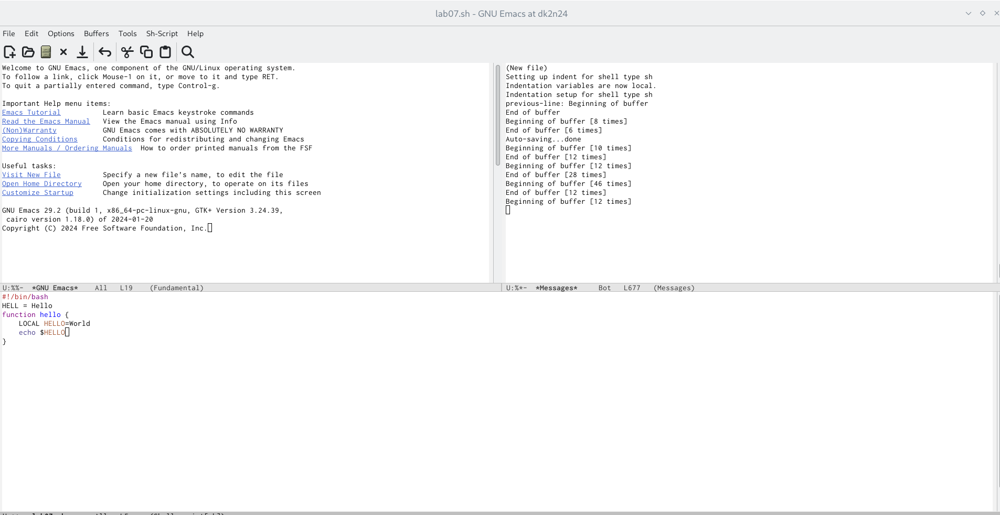
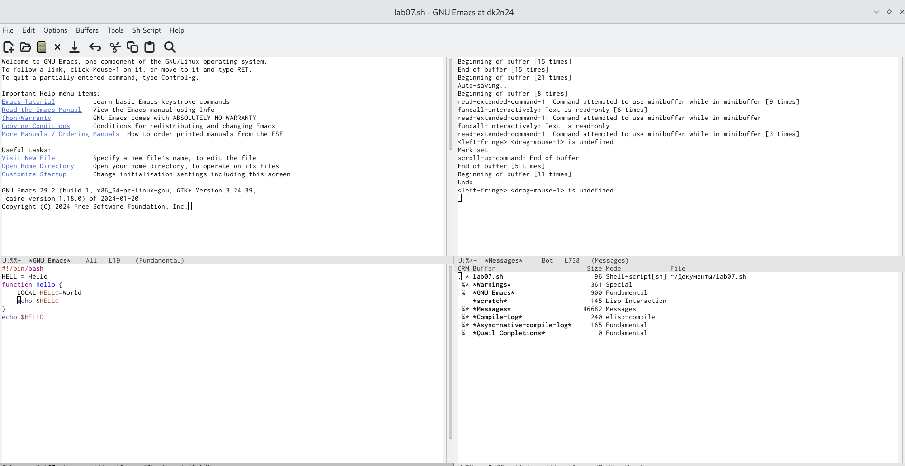
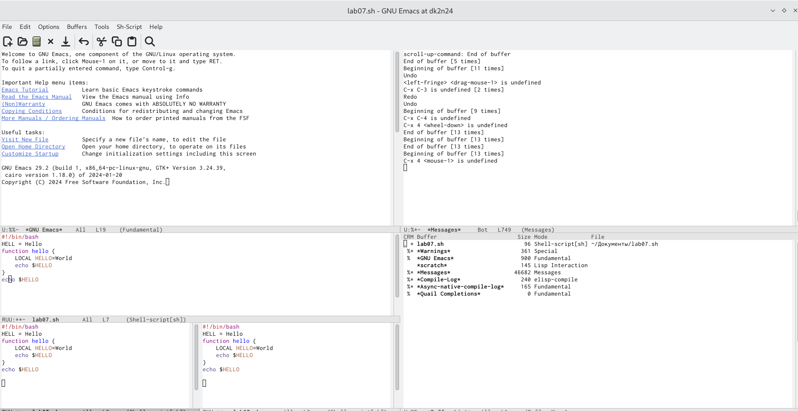

---
## Front matter
lang: ru-RU
title: Лабораторная работа №11
subtitle: текстовый редактор emacs
author:
  - Бунин А.В.
institute:
  - Российский университет дружбы народов, Москва, Россия
date: 01 января 1970

## i18n babel
babel-lang: russian
babel-otherlangs: english

## Formatting pdf
toc: false
toc-title: Содержание
slide_level: 2
aspectratio: 169
section-titles: true
theme: metropolis
header-includes:
 - \metroset{progressbar=frametitle,sectionpage=progressbar,numbering=fraction}
 - '\makeatletter'
 - '\beamer@ignorenonframefalse'
 - '\makeatother'
---

# Информация

## Докладчик

:::::::::::::: {.columns align=center}
::: {.column width="70%"}

  * Бунин Арсений Викторович
  * Студент направления Математика и Механика
  * Российский университет дружбы народов
  * [barsvic@yandex.ru](mailto:barsvic@yandex.ru)
  * <https://github.com/BuninAV>

:::
::: {.column width="30%"}

:::
::::::::::::::

# Вводная часть

## Актуальность

- Научиться редактировать и создавать файлы в текстовом редакторе emacs важно для любого пользователя Linux

## Объект и предмет исследования

- текстовый редактор emacs

## Цели и задачи

- Научиться редактировать и создавать файлы в текстовом редакторе emacs

## Материалы и методы

- Терминал Linux, текстовый редактор vim

# Выполнение лабораторной работы

## Создание нового файла. Запись нового текста в файл

{#fig:fig2 width=70%}

## Открытие всех актуальных буферов с помощью команд клавиатуры

{#fig:fig3 width=70%}

## Разделение окна на фреймы горячими клавишами

{#fig:fig4 width=70%}

#Выводы

## Итоговый слайд

Научились работать в текстовом редакторе vim

:::

