---
## Front matter
lang: ru-RU
title: Структура научной презентации
subtitle: Простейший шаблон
author:
  - Бунин А.В.
institute:
  - Российский университет дружбы народов, Москва, Россия
date: 01 января 1970

## i18n babel
babel-lang: russian
babel-otherlangs: english

## Formatting pdf
toc: false
toc-title: Содержание
slide_level: 2
aspectratio: 169
section-titles: true
theme: metropolis
header-includes:
 - \metroset{progressbar=frametitle,sectionpage=progressbar,numbering=fraction}
 - '\makeatletter'
 - '\beamer@ignorenonframefalse'
 - '\makeatother'
---

# Информация

## Докладчик

:::::::::::::: {.columns align=center}
::: {.column width="70%"}

  * Бунин Арсений Викторович
  * Студент направления Математика и Механика
  * Российский университет дружбы народов
  * [barsvic@yandex.ru](mailto:barsvic@yandex.ru)
  * <https://github.com/BuninAV>

:::
::: {.column width="30%"}

:::
::::::::::::::

# Вводная часть

## Актуальность

- Работа в файловой системе важна для любого пользователя Linux и помогает понять как устроена работа с файлами в любой ОС

## Объект и предмет исследования

- Файловая система Linux

## Цели и задачи

- Создать шаблон презентации в Markdown
- Описать алгоритм создания выходных форматов презентаций

## Материалы и методы

- Терминал Linux

# Выполнение лабораторной работы

## Создание, копирование и чтение папок и файлов

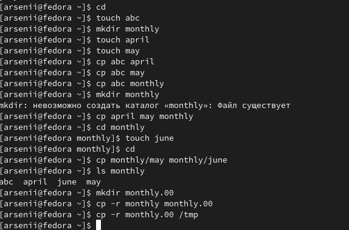

## Перемещение файлов и папок

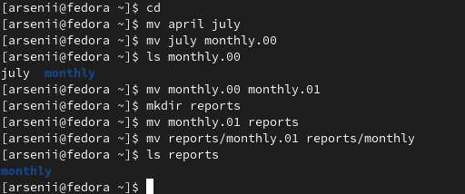

## Управление правами доступа в файловой системе

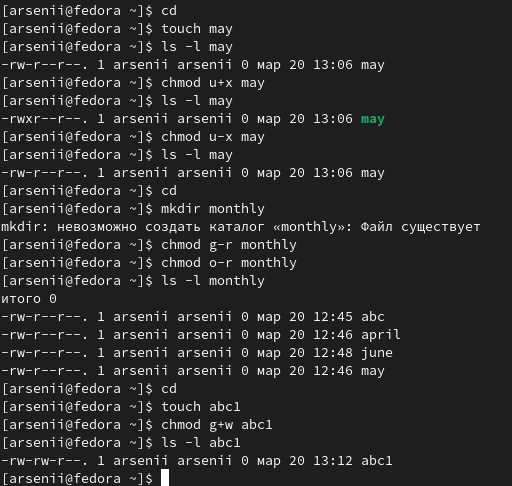

## Проверяем целостность файловой системы

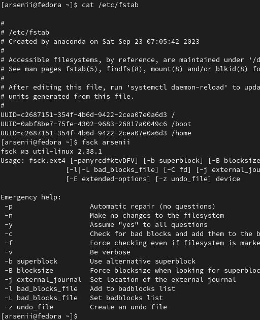

## Самостоятельная работа по созданию, копированию и чтению папок

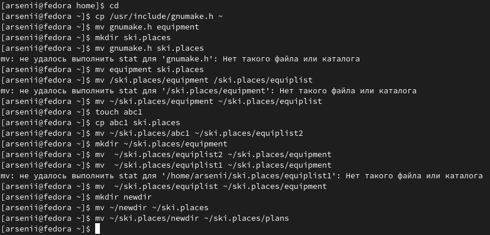

## Самостоятельная работа по редактированию прав доступа

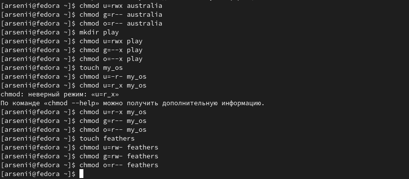

## Отказано в доступе к папке

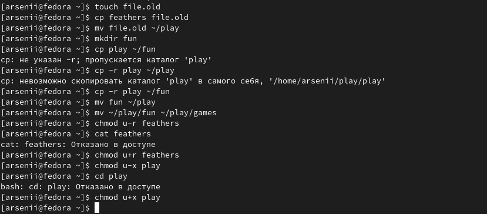

## Получение справочных сведений о командах

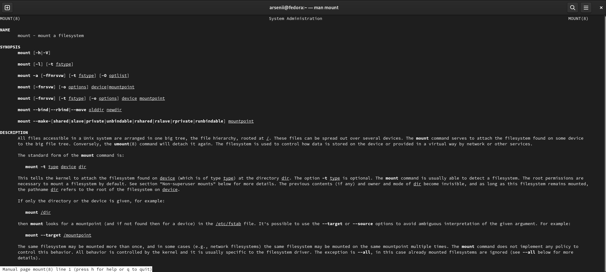

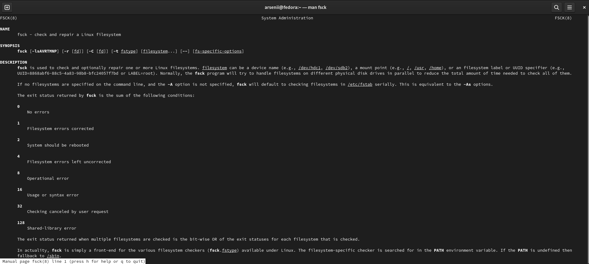

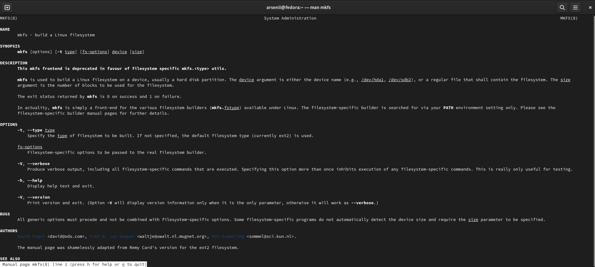

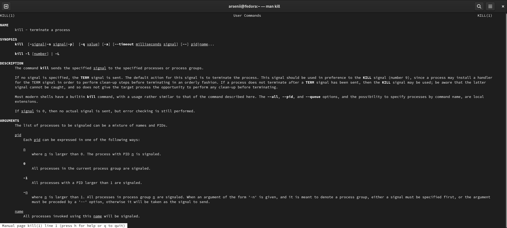

## Итоговый слайд

Научились работать в файловой системе Linux

:::

