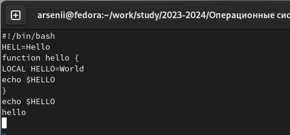
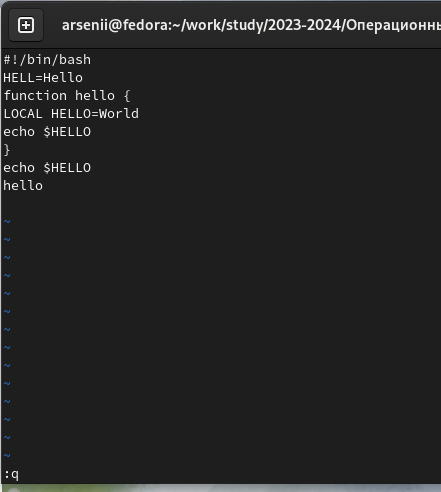
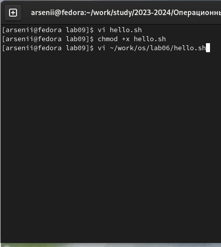
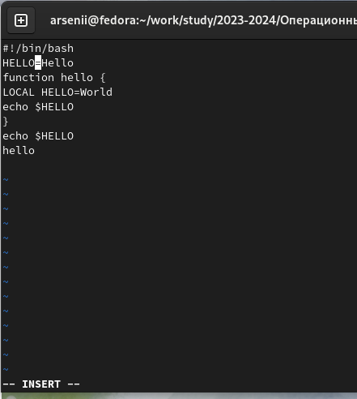
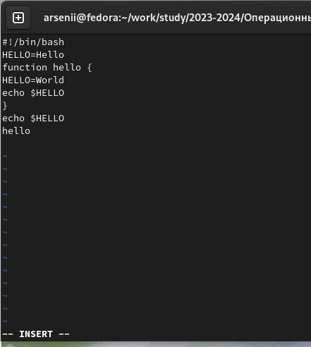
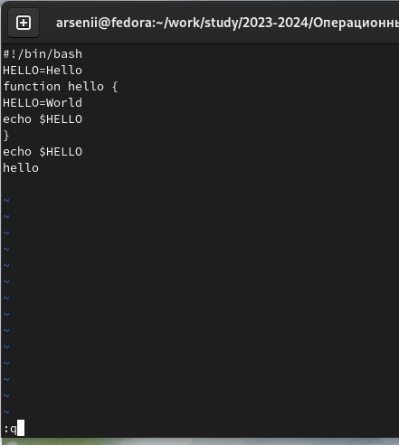

---
## Front matter
lang: ru-RU
title: Лабораторная работа №9
subtitle: текстовый редактор vim
author:
  - Бунин А.В.
institute:
  - Российский университет дружбы народов, Москва, Россия
date: 01 января 1970

## i18n babel
babel-lang: russian
babel-otherlangs: english

## Formatting pdf
toc: false
toc-title: Содержание
slide_level: 2
aspectratio: 169
section-titles: true
theme: metropolis
header-includes:
 - \metroset{progressbar=frametitle,sectionpage=progressbar,numbering=fraction}
 - '\makeatletter'
 - '\beamer@ignorenonframefalse'
 - '\makeatother'
---

# Информация

## Докладчик

:::::::::::::: {.columns align=center}
::: {.column width="70%"}

  * Бунин Арсений Викторович
  * Студент направления Математика и Механика
  * Российский университет дружбы народов
  * [barsvic@yandex.ru](mailto:barsvic@yandex.ru)
  * <https://github.com/BuninAV>

:::
::: {.column width="30%"}

:::
::::::::::::::

# Вводная часть

## Актуальность

- Научиться редактировать и создавать файлы в текстовом редакторе vim важно для любого пользователя Linux

## Объект и предмет исследования

- текстовый редактор vim

## Цели и задачи

- Научиться редактировать и создавать файлы в текстовом редакторе vim

## Материалы и методы

- Терминал Linux, текстовый редактор vim

# Выполнение лабораторной работы

## Запись текста программы в новый файл hello.sh с помощью текстового редактора vi

{#fig:fig1 width=70%}

## Сохранение файла и выход из редактора с помощью тесктовых команд

{#fig:fig2 width=70%}

## Изменение прав доступа к файлу hello.sh(рис. @fig:fig3)(рис. @fig:fig4).

{#fig:fig3 width=70%}

## Редактирование существующего файла в редакторе vim(1)

## Редактирование существующего файла в редакторе vim(2)

## Редактирование существующего файла в редакторе vim(3)

#Выводы

## Итоговый слайд

Научились работать в текстовом редакторе vim

:::

