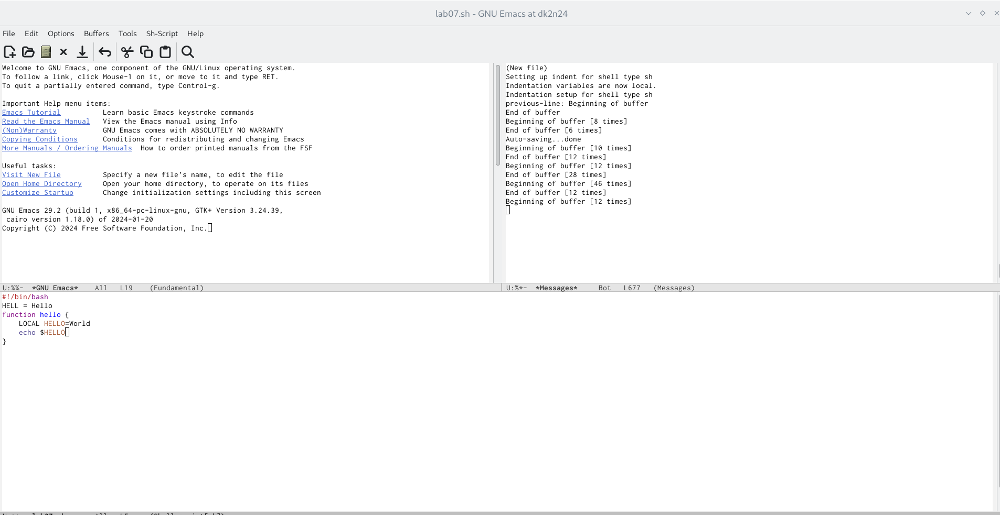
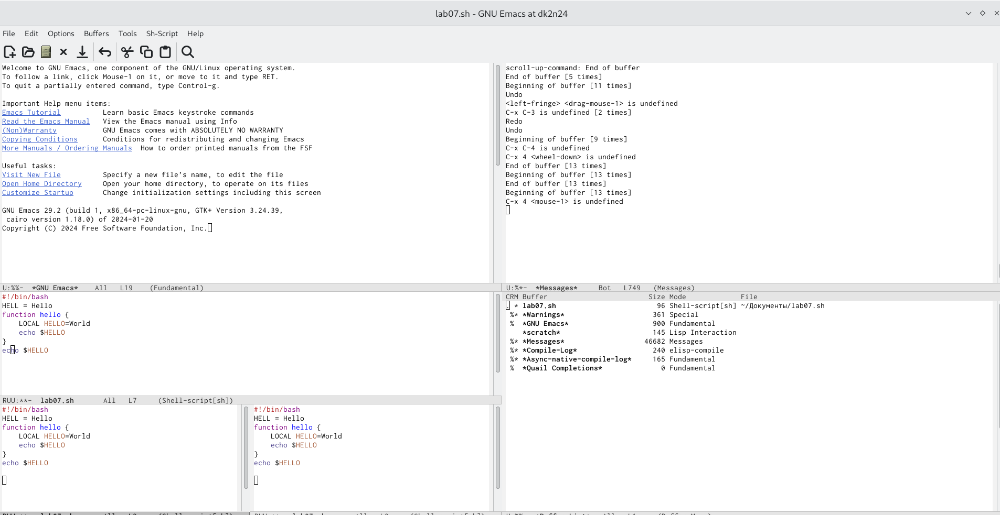

---
## Front matter
title: "Лабораторная работа №11"
subtitle: "Текстовой редактор emacs"
author: "Бунин Арсений Викторович"

## Generic otions
lang: ru-RU
toc-title: "Содержание"

## Bibliography
bibliography: bib/cite.bib
csl: pandoc/csl/gost-r-7-0-5-2008-numeric.csl

## Pdf output format
toc: true # Table of contents
toc-depth: 2
lof: true # List of figures
lot: true # List of tables
fontsize: 12pt
linestretch: 1.5
papersize: a4
documentclass: scrreprt
## I18n polyglossia
polyglossia-lang:
  name: russian
  options:
	- spelling=modern
	- babelshorthands=true
polyglossia-otherlangs:
  name: english
## I18n babel
babel-lang: russian
babel-otherlangs: english
## Fonts
mainfont: PT Serif
romanfont: PT Serif
sansfont: PT Sans
monofont: PT Mono
mainfontoptions: Ligatures=TeX
romanfontoptions: Ligatures=TeX
sansfontoptions: Ligatures=TeX,Scale=MatchLowercase
monofontoptions: Scale=MatchLowercase,Scale=0.9
## Biblatex
biblatex: true
biblio-style: "gost-numeric"
biblatexoptions:
  - parentracker=true
  - backend=biber
  - hyperref=auto
  - language=auto
  - autolang=other*
  - citestyle=gost-numeric
## Pandoc-crossref LaTeX customization
figureTitle: "Рис."
tableTitle: "Таблица"
listingTitle: "Листинг"
lofTitle: "Список иллюстраций"
lotTitle: "Список таблиц"
lolTitle: "Листинги"
## Misc options
indent: true
header-includes:
  - \usepackage{indentfirst}
  - \usepackage{float} # keep figures where there are in the text
  - \floatplacement{figure}{H} # keep figures where there are in the text
---

# Цель работы

Познакомиться с текстовым редактором emacs

# Задание

- Выполнить задания по редактированию файла в emacs

# Теоретическое введение

## Запуск Emacs
Для запуска GNU Emacs 29, просто наберите имя программы: emacs
## Выход из Emacs
Приостановить работу Emacs (или свернуть в иконку при работе в X) C-z
Выйти из Emacs C-x C-c
## Файлы
открыть файл в Emacs C-x C-f
сохранить файл обратно на диск C-x C-s
сохранить все файлы C-x s
вставить содержимое другого файла в текущий буфер C-x i
открыть нужный вам файл вместо текущего C-x C-v
сохранить буфер в указанном файле C-x C-w
Переключить состояние буфера “только для чтения” C-x C-q
## Получение помощи
Справочная система достаточно проста. Hажмите C-h (или F1) и следуйте инструкциям. Если вы в первый
раз работаете с Emacs, то наберите C-u C-h t Russian RET для вызова учебника.
Скрыть окно справки C-x 1
Прокрутить окно справки C-M-v
apropos: показать команды, соответствующие строке C-h a
показать имя функции, которая запускается клавишей C-h k
получить информацию о функции C-h f
получить информацию о режиме C-h 

# Выполнение лабораторной работы

Создание нового файла с расширениеми sh с помощью команд с клавиатуры. Запись нового текста в файл(рис. @fig:fig2)

{#fig:fig2 width=70%}

Открытие всех актуальных буферов с помощью команд клавиатуры(рис. @fig:fig3).

{#fig:fig3 width=70%}

Разделение окна на фреймы горячими клавишами(рис. @fig:fig4)

{#fig:fig4 width=70%}

# Выводы

Получили практические навыки работы с редактором emacs

# Список литературы{.unnumbered}

::: {#refs}
:::
